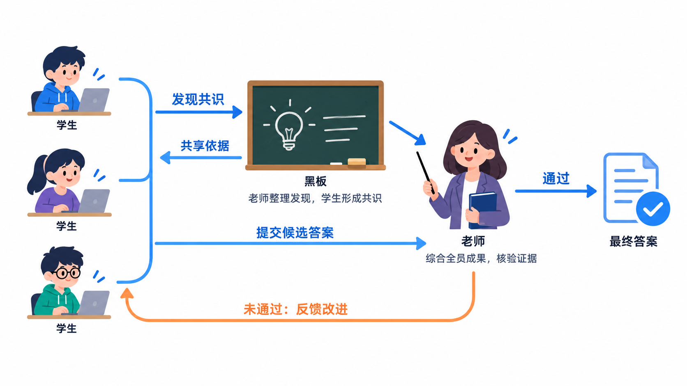
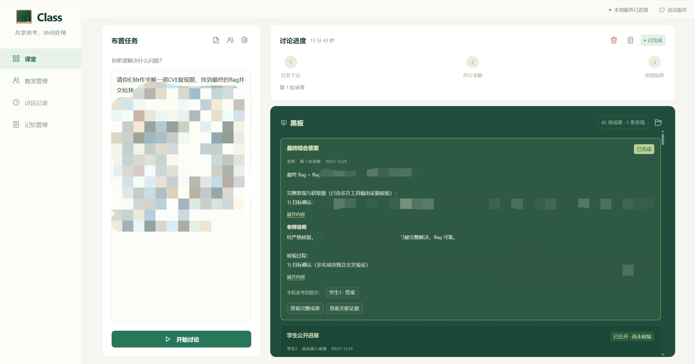

<h1 align="center">Class</h1>

<strong>一个课堂式Harness，模拟老师与学生之间的互动解题</strong>

  
  
  

## 我们的初衷

作为网络安全从业者，我们希望借助AI的力量，开发出更多实用性的架构或工具，推动行业不断向前发展！如果您喜欢我们的产品，麻烦点个⭐哦~

## 工作机制

  

<table align="center">
  <thead>
    <tr>
      <th align="center">角色</th>
      <th align="center">职责</th>
    </tr>
  </thead>
  <tbody>
    <tr>
      <td align="center"><strong>老师</strong></td>
      <td align="center">下发题目、整理发现、验收反馈</td>
    </tr>
    <tr>
      <td align="center"><strong>学生</strong></td>
      <td align="center">独立解题、提交发现、参与投票</td>
    </tr>
    <tr>
      <td align="center"><strong>共享黑板</strong></td>
      <td align="center">记录发现、阶段成果和反馈，提供共享依据</td>
    </tr>
  </tbody>
</table>

 

<strong>任务下发：</strong>老师向所有学生下发同一道完整问题。

↓

<strong>并行解题：</strong>学生独立思考、调用工具并收集证据。

↓

<strong>共享发现：</strong>每名学生的发现均记录在黑板上，其余学生进行投票，超过半数则保留，作为所有学生解题的共享依据。

↓

<strong>提交答案：</strong>任一学生提交候选答案，即可触发暂停与验收。

↓

<strong>老师验收：</strong>综合全员已有成果与证据，核验原任务是否完成。

↓

<strong>反馈或完成：</strong>未通过则保留上下文与成果，继续同一次任务；通过则输出最终答案与验收报告。

## 效果展示

  

## 免责声明

❗ Class是一个用于多Agent协同解题的通用框架。当涉及到安全测试、漏洞研究等场景时，应事先取得明确授权，并遵守相应的法律法规、合同约定及平台规则。请勿将本项目用于任何未经授权的场景中！

❗ 用户在使用Class前应自行确认操作范围，在Class运行过程中，Agent可能执行命令、修改文件或访问网络，用户应当妥善保护数据。同时，模型判断和老师Agent的验收均不保证结果正确，具体情况需用户自行分析！

❗ 开发者与贡献者不承担任何使用或滥用本项目造成的损失及相关法律责任！

## ⚖️ 许可证

本项目采用AGPL-3.0，允许个人研究及商业使用。当分发软件或通过网络向他人提供修改版本时，须按许可证要求提供相应源码、保留版权与许可声明，具体以许可证全文为准！

**商业授权：**如希望在不承担AGPL-3.0相应开源义务的条件下用于商业或闭源产品，请联系项目维护者，就其有权另行许可的代码取得书面商业授权。遵守AGPL-3.0的商业使用无需额外授权。

**贡献说明：**提交Pull Request即表示你有权提交相关内容，并同意项目维护者将你的贡献分别按AGPL-3.0及其他商业许可条款对外授权。贡献者保留其著作权。

**第三方组件：**相关组件仍遵循各自的许可证，商业授权不改变第三方组件的许可证义务。
